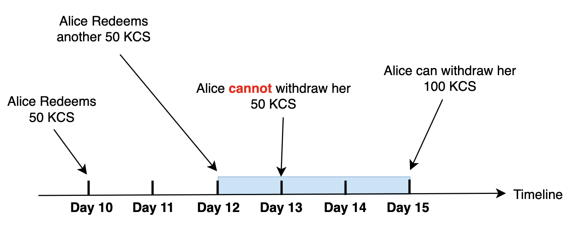

How sKCS works: A Developer's Perspective

In this article, we will dive into the technical details of the sKCS protocol. As the sKCS protocol is built upon KCC Staking, we will first review how KCC Staking works and the constraints imposed by KCC Staking. After that, we will explain how the sKCS protocol works around those constraints with innovations.  

## A Quick Review of KCC Staking 

Since the [KCC Ishikari Hardfork](https://github.com/kcc-community/KIPs/blob/main/kip-2.md), users can share the block rewards on KCC by staking their KCS to validators through [KCC Staking](https://staking.kcc.io/staking). Let's take an example to see what the constraints imposed by KCC Staking are:  

1. Alice is a fan of KCC. And she has 100.9 KCS in her wallet. However, KCC Staking only allows `staking an integer multiple of 1 KCS`. So, Alice can stake at most 100 KCS through KCC Staking. Let's assume Alice stakes exactly 100 KCS.

2. In the following days, Alice can claim her rewards whenever she wants. And the unclaimed rewards will not generate new rewards, which means `KCC Staking will not automatically compound rewards`. However, When she claims her rewards, `the rewards will be instantly transferred to her wallet`. 

3. If Alice wants her principal back, she has to make redemptions. Let's assume Alice redeems the first 50 KCS from KCC Staking on day 10. She will not receive her 50 KCS immediately. But she must wait for `three` days before withdrawing her 50 KCS.   

4. If Alice does nothing except for claiming her rewards in the following three days, she will be able to withdraw her 50 KCS on `day 13`. 

What if Alice redeems the other 50 KCS on day 12? Since her last redemption, she has already waited for two days. However, on day 13, she cannot withdraw her 50 KCS in the previous redemption because `the two redemptions are merged`. That means she must wait for another three days before withdrawing the total 100 KCS. 

From KCC Staking's perspective, the sKCS protocol is an ordinary user like Alice. Therefore, all these constraints above are also imposed on the sKCS protocol. We will see how sKCS works around them in the following sections.  

## The sKCS Protocol 

### Aggregated Voting Power

In the example above, Alice has 100.9 KCS in her wallet. However, KCC Staking only allows `staking an integer multiple of 1 KCS`. So, Alice can stake at most 100 KCS through KCC Staking. And the voting power of the remaining "0.9 KCS" is wasted. 

Here comes Bob. Bob has only 0.1 KCS in his wallet. If we can aggregate Alice and Bob's voting powers, which is 100.9 + 0.1 = 101 KCS, then we can stake the 101 KCS through KCC Staking. After that, both the 0.9 KCS from Alice and the 0.1 KCS from Bob will get rewards from KCC Staking. That is what sKCS does: You can stake any amount of KCS through the sKCS protocol. And the sKCS protocol will aggregate the voting powers of all the stakers. 

### The Exchange Rate 

Wrapping your staked and interest-bearing KCS as another ERC20 token will increase the liquidity of your assets. We borrow this idea from Lido and some other similar projects. When you stake your KCS through the sKCS protocol, some sKCS tokens will be minted to your balance. The sKCS token is ERC20-compatible, and you can transfer it to other accounts and use it in other Defi dapps. 

The amount of KCS you can exchange with 1 sKCS is the total amount of KCS belonging to sKCS token holders divided by the total supply of sKCS token:  

 

We call this ratio "the exchange rate." Because the sKCS protocol will stake users' KCS through KCC staking and get rewards from KCC Staking, the amount of KCS belonging to sKCS token holders will increase over time. As a result, "the exchange rate" will also increase over time.  However,
at any time, "the exchange rate" is the same for both staking and redemption: 

1. When you stake your KCS through the sKCS protocol, you will immediately receive sKCS tokens. The amount of sKCS token received is the amount of KCS staked divided by "the exchange rate" at that moment. 

2. To redeem sKCS token for KCS, you must first submit a redemption request. The sKCS protocol will process your request in three days. After the sKCS protocol processes your request, you must wait for another three days before withdrawing your KCS. Therefore, it will cost around three to six days to finish the redemption. When you sumbit your redemption request, the sKCS tokens you want to redeem are immediately burnt, and the amount of KCS you will receive is also determined then. The KCS you will receive is the amount of sKCS token burnt multiplied by "the exchange rate" at that moment. 

You may wonder, if all the sKCS tokens are burnt, will "the exchange rate" be infinite based on the equation above? After deploying the sKCS contract, We have already transferred some sKCS tokens to the dead address. As no one can access and redeem the sKCS tokens in the dead address, the total supply of sKCS token will never be zero.

The following example will help you understand all the above. For simplicity, we assume the only user of the sKCS protocol is Alice, and there are no fees for using the protocol.  

We assume "the exchange rate" is 1.1 in the beginning. Therefore, when Alice stakes her 110 KCS through the sKCS protocol, she will get 110/1.1 = 100 sKCS tokens in return. 

 

After a few months, let's assume KCC Staking gives the sKCS protocol 10 KCS as a reward for staking 110 KCS. And the amount of KCS belonging to sKCS holders becomes 110 + 10 = 120 KCS. Besides, "the exchange rate" turns out to be 1.2.

  

Alice will submit a redemption request if she wants to redeem her sKCS tokens. Let's assume Alice wants to redeem 50 sKCS tokens. The amount of KCS she will receive later is 50 * 1.2 = 60 KCS. After submitting the redemption request, she will wait for three to six days. Alice's 50 sKCS tokens are immediately burnt when she submits the redemption request, and the corresponding 60 KCS will no longer belong to sKCS token holders. The amount of KCS belonging to sKCS token holders becomes 60 KCS, and the total supply of sKCS token becomes 50 sKCS. As you can see, redemptions for sKCS will not change "the exchange rate".

 

### Processing Redemptions In Batches

We have already mentioned that the sKCS protocol is an ordinary user like Alice from KCC Staking's perspective. Therefore, the constraints on redemptions from KCC Staking are also imposed on the sKCS protocol.  

Let's assume that the sKCS protocol has staked all the users' KCS to a single validator through KCC Staking. Then, if the sKCS protocol redeems 50 KCS on day 10 from KCC Staking, it can withdraw the 50 KCS on day 13 like Alice:  

  

However, if the sKCS protocol also makes another redemption from KCC Staking on day 12, it cannot withdraw the first 50 KCS on day 13 but withdraw the total 100 KCS on day 15. The waiting duration is extended.  

For the sKCS protocol, the waiting duration will be unpredictable if we make one redemption to KCC Staking whenever a user submits a redemption request to the sKCS protocol. Therefore, the sKCS protocol will batch the redemption requests in three days to work around this issue.

Let's assume Alice submits several redemption requests to the sKCS protocol: She redeems 10 sKCS for 11 KCS ( "the exchange rate " is 1.1 ) on day 10, then redeems 10 sKCS for 12 KCS ( "the exchange rate " is 1.2 ) on day 11, and at last redeems 10 sKCS for 13 KCS ( "the exchange rate " is 1.3 ) on day 12. However, the sKCS protocol does not make any redemptions to KCC Staking on those days. But on day 13, the sKCS protocol batches the previous redemption requests from Alice and makes a redemption for the total 36 KCS to KCC Staking. 

  

After three days, the total 36 KCS can be withdrawn on day 16. By batching redemption requests, the waiting duration becomes predictable. In the worst case, it costs six days to finish a user's redemption if we process the requests every three days.   

In the previous discussion, we assume that the sKCS protocol has staked all the users' KCS to a single validator through KCC Staking. In KCC Staking, a user's redemptions are merged independently for each validator. Therefore, if the sKCS protocol stakes users' KCS to multiple validators, the time cost of most redemptions will always be less than six days. 

### The Automatic Compounding System 

The sKCS protocol will claim pending rewards and try to stake them to KCC Staking if the pending rewards are more than 1 KCS. As the pending rewards may not be an integer multiple of 1 KCS, the remaining part that is less than 1 KCS will be put in the buffer of the sKCS protocol. The sKCS protocol will aggregate the KCS in the buffer with either future users' stakings or future pending rewards. 

 

Besides, if the pending rewards can cover the requested KCS in recent redemption requests, the sKCS protocol will pay those redemption requests with the pending rewards rather than make a redemption to KCC Staking. This strategy has the same effect as compounding:  

  

## Summary  

The idea of the sKCS protocol is simple. However, to make it work, we have introduced several innovations to work around the constraints imposed by KCC Staking. If you want to know more about the implementation details, you can go to [the Github repository of the sKCS protocol](https://github.com/stakingkcs/skcs) and find more. 

